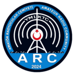

# 📡 Amatör Radyocular Derneği (ARC)

<div align="center">



**Türkiye'nin Amatör Telsiz Topluluğu**

[](https://radio.org.tr)
[](LICENSE.md)
[](https://radio.org.tr)

[🌐 Web Sitesi](https://radio.org.tr) • [📧 İletişim](https://radio.org.tr/iletisim) • [📚 Blog](https://radio.org.tr/blog)

</div>

---

## 📖 Hakkında

**Amatör Radyocular Derneği (ARC)**, YM1KTC çağrı işaretiyle faaliyet gösteren, amatör telsiz meraklıları için eğitim, teknik destek ve topluluk hizmetleri sunan bir dernektir. Bu proje, derneğimizin resmi web sitesidir ve **[Astro 5.0](https://astro.build/)** ve **[Tailwind CSS](https://tailwindcss.com/)** kullanılarak geliştirilmiştir.

### ✨ Temel Özellikler

- 📡 **Amatör Telsiz Kaynakları** - Eğitim içerikleri, rehberler ve teknik bilgiler
- 🗓️ **Etkinlik Takvimi** - Yaklaşan toplantılar, yarışmalar ve özel etkinlikler
- 📰 **Blog ve Haberler** - Kategoriler ve etiketlerle düzenlenmiş içerikler
- 📱 **DMR İletişim Rehberi** - Bölgesel çağrı işaretleri ve DMR kimlikleri
- 🛠️ **DMR Liste Düzenleyici** - CSV dosyalarını yükleme, düzenleme ve dışa aktarma
- 📧 **İletişim Formu** - Netlify Forms ile güvenli e-posta gönderimi
- 🔄 **Çevrim Bilgileri** - Düzenli telsiz kontrolleri ve iletişim çevrimleri
- 🌐 **Çoklu Dil Desteği** - Türkçe ve İngilizce içerikler
- 📊 **SEO Optimizasyonu** - Hızlı yükleme süreleri ve arama motoru dostu yapı

---

## 📑 İçindekiler

- [📖 Hakkında](#-hakkında)
- [🚀 Kurulum](#-kurulum)
- [💻 Geliştirme](#-geliştirme)
- [🏗️ Teknolojiler](#️-teknolojiler)
- [📡 DMR İletişim Bilgileri](#-dmr-i̇letişim-bilgileri)
- [🤝 Katkıda Bulunma](#-katkıda-bulunma)
- [📄 Lisans](#-lisans)

---

## 🚀 Kurulum

### Gereksinimler

- Node.js 18.x veya üzeri
- npm veya yarn paket yöneticisi

### Adımlar

```bash
# 1. Depoyu klonlayın
git clone https://github.com/YM1KTC/ARC-Web-Sitesi.git
cd ARC-Web-Sitesi

# 2. Bağımlılıkları yükleyin
npm install

# 3. Geliştirme sunucusunu başlatın
npm run dev
```

Web sitesi `http://localhost:4321` adresinde çalışacaktır.

---

## 💻 Geliştirme

### Kullanılabilir Komutlar

| Komut                | Açıklama                                      |
|----------------------|-----------------------------------------------|
| `npm run dev`        | Geliştirme sunucusunu başlatır               |
| `npm run build`      | Üretim için build alır                        |
| `npm run preview`    | Build önizlemesi yapar                        |
| `npm run astro`      | Astro CLI komutlarını çalıştırır             |

### Proje Yapısı

```
ARC-Web-Sitesi/
├── src/
│   ├── assets/          # Görseller ve medya dosyaları
│   ├── components/      # Astro/React bileşenleri
│   ├── content/         # Blog yazıları ve içerikler
│   ├── layouts/         # Sayfa düzenleri
│   ├── pages/           # Sayfa rotaları
│   └── utils/           # Yardımcı fonksiyonlar
├── public/              # Statik dosyalar
└── astro.config.mjs     # Astro yapılandırması
```

---

## 🏗️ Teknolojiler

Bu proje modern web teknolojileri kullanılarak geliştirilmiştir:

- **[Astro 5.0](https://astro.build/)** - Modern statik site oluşturucu
- **[Tailwind CSS](https://tailwindcss.com/)** - Utility-first CSS framework
- **[TypeScript](https://www.typescriptlang.org/)** - Tip güvenliği
- **[Netlify Forms](https://www.netlify.com/products/forms/)** - Sunucusuz form işleme
- **[MDX](https://mdxjs.com/)** - Markdown içinde JSX desteği
- **Responsive Design** - Mobil uyumlu tasarım

---

## 📡 DMR İletişim Bilgileri

Bölgesel operatörlerimize aşağıdaki DMR kimlikleri üzerinden ulaşabilirsiniz:

| Çağrı İşareti | DMR ID  | Bölge          |
|---------------|---------|----------------|
| YM1KTC        | 2866808 | Bölge 1        |
| YM2KTR        | 2867887 | Bölge 2        |
| YM3KTC        | 2867234 | Bölge 3        |
| YM4KTC        | 2867235 | Bölge 4        |
| YM5KTC        | 2867187 | Bölge 5        |
| YM6KTB        | 2867237 | Bölge 6        |
| YM7KTC        | 2867238 | Bölge 7        |
| YM8KTC        | 2867239 | Bölge 8        |
| YM9KTC        | 2867240 | Bölge 9        |
| YM0KTC        | 2867241 | Bölge 0        |

### DMR Liste Düzenleyici

Web sitemiz, DMR contact listelerinizi kolayca düzenleyebileceğiniz bir araç sunar:

- CSV dosyalarını yükleme
- Tabloda düzenleme yapma
- Filtreleme ve arama
- CSV formatında dışa aktarma

🔗 **[DMR Düzenleyici'ye Git](https://dmr.radio.org.tr/)**

---

## 🤝 Katkıda Bulunma

Projeye katkıda bulunmak isterseniz:

1. Bu depoyu fork edin
2. Yeni bir branch oluşturun (`git checkout -b feature/yeni-ozellik`)
3. Değişikliklerinizi commit edin (`git commit -m 'feat: yeni özellik eklendi'`)
4. Branch'inizi push edin (`git push origin feature/yeni-ozellik`)
5. Pull Request oluşturun

### Geliştirme Kuralları

- Kod yazmadan önce mevcut yapıya uygun olduğundan emin olun
- Anlamlı commit mesajları yazın
- TypeScript tip güvenliğine dikkat edin
- Responsive tasarıma uygun kodlar yazın

---

## 📄 Lisans

Bu proje [MIT Lisansı](./LICENSE.md) altında lisanslanmıştır.

---

<div align="center">

**73 de YM1KTC** 📡

[🌐 radio.org.tr](https://radio.org.tr) • [📧 iletisim@radio.org.tr](mailto:iletisim@radio.org.tr)

</div>
