## VFO da Röle ve Simplex Frekansı Ekleme

Amatör telsiz kullanıcıları için röle (repeater) ve simplex frekanslarının doğru şekilde programlanması, sağlıklı bir haberleşme için oldukça önemlidir. Bu makalede, **Türkiye’de kullanılan shift ve offset değerlerini baz alarak** amatör telsizlere röle ve simplex frekanslarının nasıl ekleneceğini anlatacağız. Ayrıca, röle kuyruk sesi hakkında da bilgi vereceğiz.

### **Röle Frekansı Nedir ve Neden Kullanılır?**

Röleler (repeater), sinyali alıp güçlendirerek farklı bir frekanstan yeniden yayarak menzili artıran istasyonlardır. **Özellikle el telsizleri ve düşük güçlü cihazlar için haberleşmeyi büyük ölçüde geliştirir.**

Röle frekansları **giriş (RX)** ve **çıkış (TX)** olmak üzere iki farklı frekanstan oluşur:

- **Çıkış Frekansı (Downlink):** Rölenin yayın yaptığı ve kullanıcıların dinlediği frekanstır.

- **Giriş Frekansı (Uplink):** Kullanıcıların telsizlerinden röleye sinyal gönderdiği frekanstır.

Türkiye’de amatör telsiz röleleri için **varsayılan shift (kaydırma) ve offset değerleri** şöyledir:

**Bant**
**Shift Yönü**
**Offset Değeri**

VHF Röle (2m bandı)

- (eksi)
  0.600 MHz

UHF Röle (70cm bandı)

- (eksi)
  7.600 MHz

Örneğin, **439.200 MHz** frekansında çalışan bir UHF rölesine erişmek için telsizinizin TX frekansını şu şekilde ayarlamanız gerekir:

- **RX (Dinleme) Frekansı:** 439.200 MHz

- **TX (Gönderme) Frekansı:** 431.600 MHz (439.200 - 7.600 MHz)

- **Shift Yönü (-/+):** - (Eksi)

- **Offsett  : ** 7.600 Mhz

- **Tx Tone  : ** 88,5

\*\* 

_Bölgenizdeki güncel röle bilgilerine **[TA-ROLE](https://ta-role.com/)** Sitesinden ulaşabilirsiniz._

### **Röle Frekansı Nasıl Eklenir?**

Çoğu el telsizi ve mobil telsiz benzer menülerle çalışır. **Baofeng, Kenwood, Icom, Yaesu, AnyTone gibi cihazlar için** genel adımlar şunlardır:

### **Manuel Olarak Röle Frekansı Kaydetme (TEKSER  UV-99 Örneği)**

Bu yazıda TEKSER UV 99 frekans ekleme de örnek olarak gösterilecektir. Telsizin tüm özelliklerinden bahsedildiği ayrı bir makale kısa süre sonra yayınlanacaktır.

#### **VFO Moduna Geçin: **

Telsizinizi açın ve **VFO (Frekans) moduna** alın. Bunun için "**_# Mod_**" tuşuna basın.\*\*

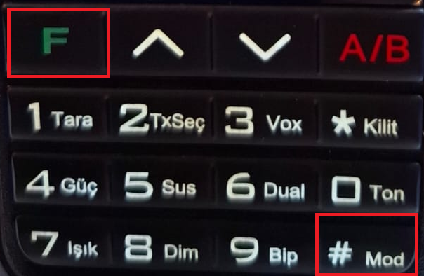
*Şekil-1 Tekser UV-99 Klavyesi*

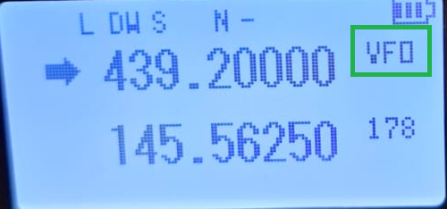
*VFO Modu*

#### **Rx Frekansını Girin**

**VFO Modu **na geçtikten sonra [TA-ROLE ](https://ta-role.com/)sitesinden eklemek istediğiniz rölenin Okuma Rx frekansını ekrana yazın. Tekstilkent Rölesi 439.200 Mhz

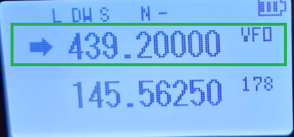
*Şekil-2 VFO Mod Frekans girişi*

#### **Tx Gücünü Ayarlayın**

Genelde cihazlarda Tx gücü H=High (Yüksek), M=Medium (Orta), L=Low (Düşük) olarak üç seçenek bulunmaktadır. Her zaman cihaz ve batarya sağlığı için Düşün mod ayarlayın ulaşmak istediğiniz mesafe veya Röleye göre modu artırabilirsiniz.

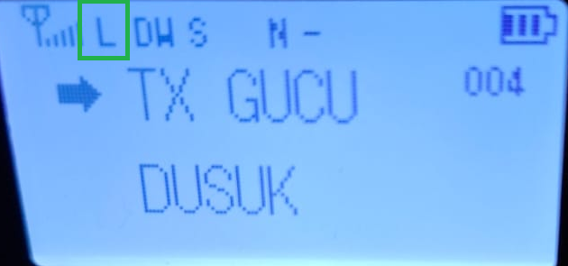
*Şekil-3 Cihaz Tx Gücü*

#### **Offsett Değerini Ayarlayın**

Türkiyede Offset değeri UHF Frekans röleler için 7.600, VHF röleler için 0,600 olarak belirlenmişti.

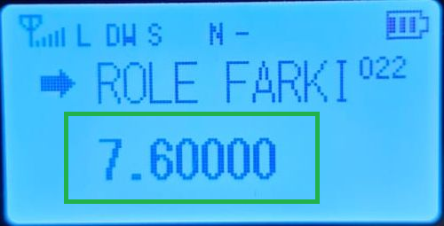
*Şekil-4 Offset Ayarı*

#### **Shift Kaydırma Yönünü Belirleyin**

Shift kaydırma yönü türkiye için sadece ( **-** ) Eksi olarak belirlenmiştir.

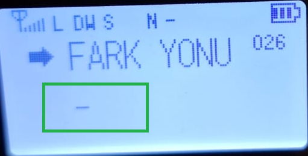
*Şekil-5 Shift Ayarı*

#### **RxTx Ton ( CTCSS veya DCS ) Frekansını girin**

Rölelerin tamamında en azından Rx Ton değeri belirlenmiştir. Bir çok rölede Rx ve Tx ton da olabilir. Bunların bir çoğu RxTx aynı olabileceği gibi ayrı, ayrı da olabilir.  Örneğin 1. Bölge İstanbul Zeytinburnu rölesinin TxRx Ton' u 123 dür. Menüden "**_TXRX Tonu_**" kısmın dan 123 ton değerini seçmelisiniz. Aynı bölgede Tekstilkent rölesinin sadece Tx Tone **88,5 **olduğu için Telsizden "**_TX Tonu_**"menüsünden 88,5 olarak seçmelisiniz.

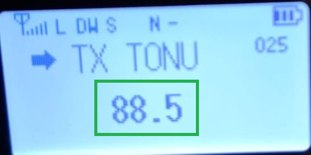
*Şekil-6 Tx Ton girişi*

#### **Band Genişliğinin Ayarlanması**

Türkiyede Tüm röle ve Simplex frekanslarda Band **_Narrow_** (**_Dar_**) olmak zorundadır. Telsiz "**Band Genişliği**"menüsünden  **DAR **seçeneğini seçip sonra kanalı kaydetme adımına geçebilirsiniz.

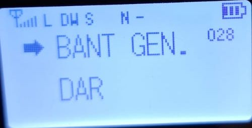
*Şekil-7 Band Genişliği*

#### **Kanalın Kayıt Edilmesi**

Frekansı ekleyip Mandala basıp röle çıkışını veya simplex olarak test edildikten sonra telsiz üzerinde yeşil fonksiyon tuşuna uzun basılı tutun "**_F_**". Kanal numarası yanıp sönmeye başladıktan sonra ok tuşları ile kayıt etmek istediğiniz boş kanalı seçin ve kısa bir şekilde "**_# Mod_**"   tuşuna basın ve frekansınız kanala kayıt edilmiş olacaktır.

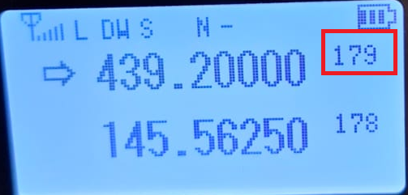
*Şekil-8 Kanal kayıt edilmesi*

### **Simplex Frekansı Nedir ve Nasıl Eklenir?**

Simplex haberleşme, telsizlerin **araya bir röle girmeden doğrudan birbirleriyle iletişim kurmasıdır.**

Türkiye’de amatör bandda yaygın kullanılan **bazı simplex frekansları şunlardır:**

**Bant**
**Simplex Frekansları**

VHF (2m)
145.300 MHz

VHF (2m)
145.500 MHz (FM Genel Çağrı Frekansı)

UHF (70cm)
433.500 MHz (FM Genel Çağrı Frekansı)

UHF (70cm)
433.550 MHz

\*\*
Daha detaylı bir bilgi için :

-

[Amatör Band Planı: UHF (Ultra High Frequency)](https://radio.org.tr/amator-band-plani-uhf-ultra-high-frequency/)

- [Amatör Band Planı: VHF (Very High Frequency)](https://radio.org.tr/amator-band-plani-vhf-very-high-frequency/)

makalelerimizi inceleyebilirsiniz.

### **Simplex Frekansı Telsize Nasıl Eklenir?**

#### **VFO moduna geçin.**

Telsizinizi açın ve **VFO (Frekans) moduna** alın. Bunun için "**_# Mod_**" tuşuna basın.\*\*

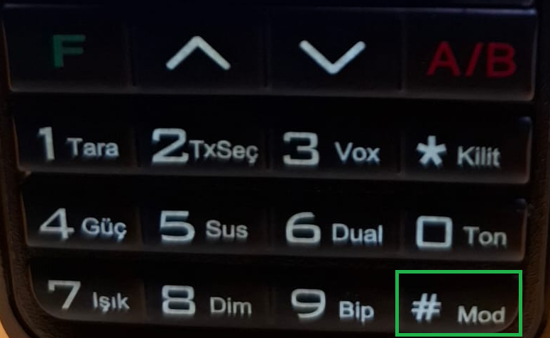
*Şekil-1 Tekser UV-99 Klavyesi*

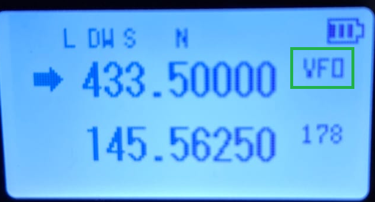
*Şekil-2 VFO Mod*

#### **Simplex frekansını girin** (örneğin 145.500 MHz).

VFO modunda simplex frekansını girin.

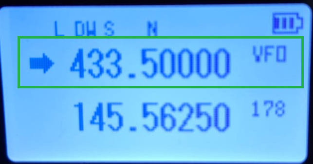
*Şekil-3 Simplex Frekansı Girişi*

Simplex Frekanslar hakkında daha detaylı bilgi için :

-

[Amatör Band Planı: UHF (Ultra High Frequency)](https://radio.org.tr/amator-band-plani-uhf-ultra-high-frequency/)

- [Amatör Band Planı: VHF (Very High Frequency)](https://radio.org.tr/amator-band-plani-vhf-very-high-frequency/)

Makaleleri inceleyebilirsiniz.

#### **Shift ve Offset’i kapatın:**

Simplex frekanslarda Shift (kaydırma) ve Offset (7.600/0,600) olmadığı için bu alanları kapatmanız gerekmektedir. Bunun için menüden Fark Yönü menüseüne geçip ok tuşları ile "KAPALI" seçin ve Röle Farkı menüsünde ise "0.00000" yazarak farkı kapatabilirsiniz.

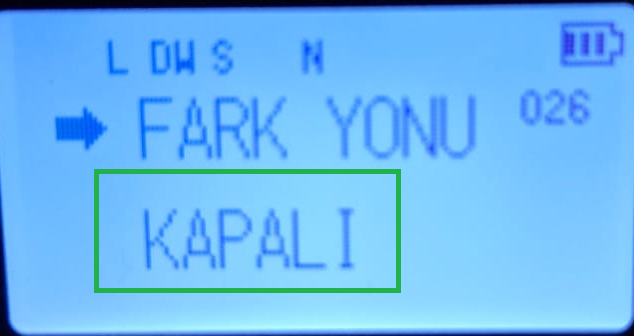
*Şekil-4 Shift Ayarı*

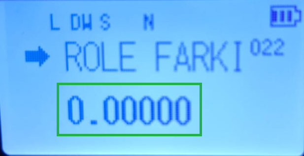
*Şekil-5 Offset Ayarı*

#### **CTCSS veya DCS (RxTx Ton) kodu eklemeyin.**

Simplex frekanslarda TxRxTon kullanılmadığı için bu ton kısmınıda kapatın. Bunun için TX Tonu veya RX Tonu menüsünde seçip düzenlemek için yeşil "F" tuşuna basıp seçin ve "KAPALI" seçeneğini görene kadar "\* Kilit" tuşuna basın.

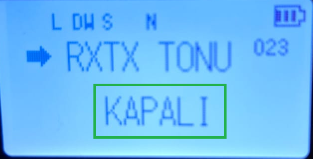
*Şekil-6 RXTX Ton Kapalı*

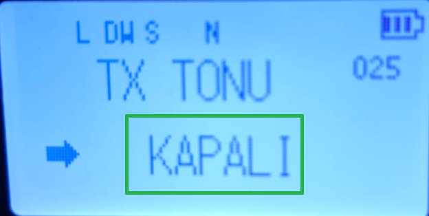
*Şekil-7 TX ton kapalı*

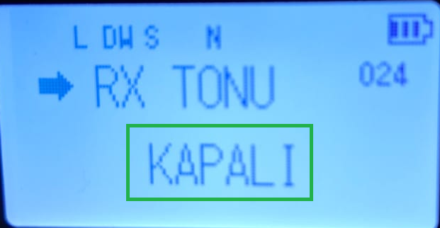
*Şekil-8 RX Ton kapalı*

#### **Band Genişliğinin Ayarlanması**

Türkiyede Tüm röle ve Simplex frekanslarda Band **_Narrow_** (**_Dar_**) olmak zorundadır. Telsiz "**Band Genişliği**"menüsünden  **DAR **seçeneğini seçip sonra kanalı kaydetme adımına geçebilirsiniz.

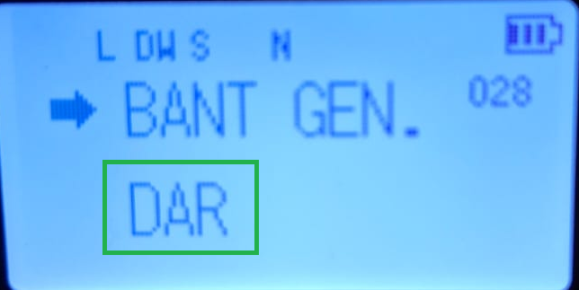
*Şekil-9 Band Genişliği "DAR" (Narrow) seçili*

#### **Frekansı hafızaya kaydedin.**

Frekansı ekleyip Mandala basıp röle çıkışını veya simplex olarak test edildikten sonra telsiz üzerinde yeşil fonksiyon tuşuna uzun basılı tutun "**_F_**". Kanal numarası yanıp sönmeye başladıktan sonra ok tuşları ile kayıt etmek istediğiniz boş kanalı seçin ve kısa bir şekilde "**_# Mod_**"   tuşuna basın ve frekansınız kanala kayıt edilmiş olacaktır.

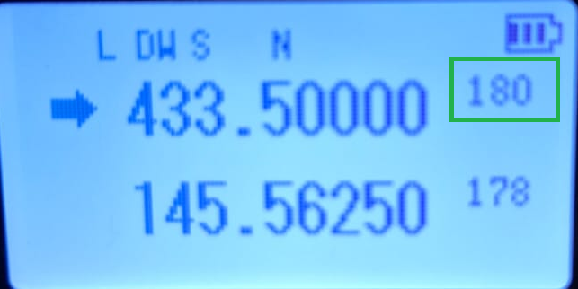
*Şekil-10 Frekans boş kanala kaydedildi.*

## **Röle Kuyruk Sesi Nedir?**

Rölelerin sinyal geçişi tamamlandıktan sonra, kullanıcıların konuşmanın bittiğini anlaması için **bir "kuyruk sesi" (tail tone) verir.**

### **Kuyruk Sesi Türleri:**

- **Bip Sesi:** Röle üzerinden konuşma bittiğinde kısa bir "bip" sesi gelir.

- **Şasi Gıcırtısı (Tail Noise):** Röle kapanırken hafif bir statik ses duyulabilir.

Bazı röleler, **"Anti-Tail Noise"** özelliği ile bu sesi engelleyebilir.

Eğer telsizinizin kuyruk sesine tepki vermesini istemiyorsanız, **ROGER BEEP (ROG BP) ayarını kapatabilirsiniz.**

## **Sonuç**

Amatör telsizlerde **röle ve simplex frekanslarını doğru programlamak**, iletişiminizin verimli olmasını sağlar. Türkiye’de VHF için **-0.600 MHz** ve UHF için **-7.600 MHz** offset kullanıldığını unutmayın. Ayrıca, **röle kuyruk sesleri, konuşmanın bittiğini anlamak için kullanılan bir işarettir** ve bazı rölelerde farklı tonlar olabilir.

Bu rehber ile telsizinizi daha etkili kullanabilir, **röleler ve simplex frekanslarında sorunsuz haberleşme sağlayabilirsiniz.**

**73! TA1SPH – Suphi Çakır**

_Bu konuda yardıma ihtiyacınız olursa **[Amatör Telsizci](https://t.me/amatortelsizci)** telegram grubundan bizlerle iletişime geçebilirsiniz._

