import { Image } from 'astro:assets';
import digivoice_image_001 from '../../assets/images/blogs/digivoice_image_001.jpeg';
import digivoice_image_002 from '../../assets/images/blogs/digivoice_image_002.jpeg';
import digivoice_image_003 from '../../assets/images/blogs/digivoice_image_003.jpeg';
import digivoice_image_010 from '../../assets/images/blogs/digivoice_image_010.jpeg';
import digivoice_image_011 from '../../assets/images/blogs/digivoice_image_011.jpeg';
import digivoice_image_012 from '../../assets/images/blogs/digivoice_image_012.jpeg';
import digivoice_image_018 from '../../assets/images/blogs/digivoice_image_018.jpeg';
import digivoice_image_019 from '../../assets/images/blogs/digivoice_image_019.jpeg';
import digivoice_image_021 from '../../assets/images/blogs/digivoice_image_021.jpeg';
import digivoice_image_022 from '../../assets/images/blogs/digivoice_image_022.jpeg';
import digivoice_image_023 from '../../assets/images/blogs/digivoice_image_023.jpeg';
import digivoice_image_024 from '../../assets/images/blogs/digivoice_image_024.jpeg';
import digivoice_image_025 from '../../assets/images/blogs/digivoice_image_025.jpeg';

  

    <iframe width="100%" height="215" src="https://www.youtube.com/embed/c0Nu5Aq1gQw" title="Digi Voice DMR Uygulaması Tanıtım Videosu" frameborder="0" allow="accelerometer; autoplay; clipboard-write; encrypted-media; gyroscope; picture-in-picture; web-share" referrerpolicy="strict-origin-when-cross-origin" allowfullscreen></iframe>
  

  

    <iframe width="100%" height="215" src="https://www.youtube.com/embed/TeX7uNVdIDc" title="Digi Voice Uygulaması Android ve IOS (Bedava!)" frameborder="0" allow="accelerometer; autoplay; clipboard-write; encrypted-media; gyroscope; picture-in-picture; web-share" referrerpolicy="strict-origin-when-cross-origin" allowfullscreen></iframe>
  

## 📡 Digi Voice Nedir? Cebinizdeki Dijital Röle Ağı

Amatör telsizcilikte dijital dünyaya adım atmak isteyen pek çok arkadaşımızın karşısına ilk çıkan engel, bir **hotspot** (MMDVM, OpenSpot, Zumspot vb.) veya DMR uyumlu bir telsiz temin etme zorunluluğudur. İşte tam bu noktada, **Digi Voice** uygulaması devreye giriyor ve DMR ağlarına telsiz ya da ek donanım olmadan, doğrudan akıllı telefonunuz veya bilgisayarınız üzerinden bağlanmanızı sağlıyor.

Bu yazıda, DMR'ın ne olduğundan BrandMeister ağına, Digi Voice uygulamasının avantajlarından adım adım Android kurulumuna kadar merak ettiğiniz her şeyi bulacaksınız. Yazının sonunda, kendi telefonunuzdan ilk QSO'nuzu yapmaya hazır olacaksınız.

### 🔤 DMR Nedir?

**DMR (Digital Mobile Radio)**, ETSI tarafından standartlaştırılmış, sesi analog dalga yerine sayısal veriye çevirerek ileten dijital bir telsiz haberleşme sistemidir. Başlangıçta ticari/profesyonel kullanım için tasarlanmış olsa da, sunduğu net ses kalitesi, düşük bant genişliği ihtiyacı ve en önemlisi **internet altyapısı üzerinden dünya çapında röle/ağ bağlantısı kurabilme özelliği** sayesinde amatör telsizciler arasında hızla yaygınlaşmıştır.

DMR sisteminde dikkat edilmesi gereken birkaç temel kavram vardır:

| Kavram | Açıklama |
|---|---|
| **DMR ID** | [radioid.net](https://radioid.net) üzerinden çağrı işaretinize özel alınan, dünya genelinde benzersiz kimlik numarası |
| **Talkgroup (TG)** | Konuşmaların gerçekleştiği sanal görüşme grupları (örn. TG 91 Dünya Geneli, TG 286 Türkiye) |
| **Time Slot (TS)** | Aynı frekansta iki ayrı konuşmanın eş zamanlı taşınmasını sağlayan zaman dilimi (TS1/TS2) |
| **Color Code (CC)** | Analog telsizlerdeki CTCSS tonuna benzer, röle/ağ eşleşmesini sağlayan kod |

### 🌐 BrandMeister DMR Network Nedir?

**BrandMeister**, dünya genelinde yüzlerce ülkede binlerce röle ve hotspotu birbirine bağlayan, açık kaynaklı ve amatör telsizciler tarafından en yaygın kullanılan DMR ana ağıdır (master network). Herhangi bir talkgroup'a, ağa bağlı herhangi bir röle veya hotspot üzerinden erişebilmenizi sağlar; özel çağrı (private call), web üzerinden ses dinleme (Hoseline) ve kapsamlı bir self-servis panel (**SelfCare**) sunar. SelfCare üzerinden kendi hotspot şifrenizi, favori talkgruplarınızı ve güvenlik ayarlarınızı yönetebilirsiniz — Digi Voice kurulumunda da bu şifreye ihtiyaç duyacaksınız.

### 📻 Telsiz Olmadan DMR Görüşmesi Yapılabilir mi?

Evet. DMR ağına bağlanmak için mutlaka fiziksel bir DMR telsize veya hotspot cihazına ihtiyacınız yok. **Digi Voice** gibi yazılım tabanlı istemciler, RPTL/RPTK/RPTC el sıkışma protokolünü ve gerekli ses kodekini (Codec2) doğrudan uygulama içinde çalıştırarak, akıllı telefon veya bilgisayarınızı internet üzerinden bir "sanal DMR terminali" haline getirir. Bu sayede lisanslı bir amatör telsizci, yanında telsizi olmasa bile cebindeki telefonla BrandMeister, TGIF veya FreeDMR ağlarına katılabilir.

> ⚠️ Unutmayın: Digi Voice'u kullanmak için geçerli bir amatör telsiz lisansına ve radioid.net üzerinden alınmış bir DMR ID'ye sahip olmanız gerekir.

### 🇹🇷 Digi Voice Uygulaması Neden Öne Çıkıyor?

Digi Voice, **TB1TFO Fatih ÖNDER** tarafından geliştirilen, tamamen yerli ve milli bir amatör telsiz yazılımıdır. Şu anda **DMR protokolünü tam olarak** desteklerken; M17, YSF/FCS, D-STAR, P25 ve IAX gibi diğer dijital modlar da uygulama arayüzünde yer alıyor ve aktif olarak geliştiriliyor. Uygulamayı diğer yazılım tabanlı DMR istemcilerinden ayıran ve yeni başlayanlar için özellikle cazip kılan bazı özellikler şunlar:

- 🎙️ **Codec2 tabanlı gerçek ses kodlama/çözme** — mbelib temelli, ekstra lisans veya harici kod gerektirmiyor.
- 🪪 **RadioID.net entegrasyonu** — çağrı işaretini yazdığınızda DMR ID'nizi otomatik sorguluyor.
- 🗂️ **Hazır Talkgroup veritabanı** — TG91 Dünya Geneli, TG92 Avrupa, TG286 Türkiye gibi popüler gruplar önceden yüklü geliyor.
- 🌍 **GPS & APRS desteği** — konumunuzu otomatik olarak aprs.fi üzerinden yayınlayabiliyor.
- ⌨️ **Fiziksel tuşu PTT olarak atama** — telefonunuzdaki ses tuşunu gerçek bir PTT düğmesine çeviriyor.
- 🇹🇷 **Tam Türkçe arayüz** — kurulum ve kullanım sürecinde dil bariyeri yaşamıyorsunuz.
- ⚙️ **Ayar yedekleme/geri yükleme** — cihaz değiştirdiğinizde ayarlarınızı saniyeler içinde taşıyabiliyorsunuz.

Diğer yazılım tabanlı çözümlere kıyasla kurulumun ve ayarların bu denli sade, Türkçe ve adım adım anlaşılır olması, Digi Voice'u özellikle **yeni başlayan amatör telsizciler** için pratik bir seçenek haline getiriyor.

---

## 🛠️ Digi Voice Kurulumu

### 📥 Uygulamayı Nereden İndirebilirim?

Digi Voice; Android, iOS, iPadOS, watchOS, macOS, Windows ve Linux olmak üzere neredeyse tüm platformlarda kullanılabiliyor.

| Platform | Gereksinim | Bağlantı |
|---|---|---|
| 🤖 Android | Android 5.0 ve üzeri | [Play Store'dan İndir](https://digivoice.algsoft.net.tr/?go=android) |
| 📻 PoC Telsizler | Hytera PNC370 gibi Android tabanlı PoC cihazlar | [İndir](https://digivoice.algsoft.net.tr/?go=poc) |
| 📱 iPhone / iPad / Apple Watch | iOS 15+ / watchOS 9+ | [App Store'dan İndir](https://digivoice.algsoft.net.tr/?go=ios) |
| 💻 macOS | macOS 12 ve üzeri | [App Store'dan İndir](https://digivoice.algsoft.net.tr/?go=macos) |
| 🪟 Windows | Windows 10 - 11 | [İndir](https://digivoice.algsoft.net.tr/?go=windows) |
| 🐧 Linux | Debian tabanlı (.deb) veya AppImage | [İndir](https://digivoice.algsoft.net.tr/?go=linux) |

Uygulamanın kaynak kodlarına ve gelişmelerine [GitHub sayfasından](https://github.com/cektor/Digi-Voice-) da göz atabilirsiniz.

Aşağıda, en çok tercih edilen platform olan **Android üzerinden örnek bir kurulumu** adım adım inceliyoruz. Diğer platformlardaki kurulum ve ayar mantığı da büyük ölçüde benzerdir.

### 🔽 Adım 1 — İndirme ve İzin Ekranına Geçiş

  <figure style="flex:1; min-width:150px;">
    <Image src={digivoice_image_001} alt="Google Play Store'da Digi Voice uygulama sayfası" />
  </figure>
  <figure style="flex:1; min-width:150px;">
    <Image src={digivoice_image_002} alt="Digi Voice uygulaması indirme ekranı" />
  </figure>
  <figure style="flex:1; min-width:150px;">
    <Image src={digivoice_image_003} alt="Digi Voice uygulaması yükleme tamamlandı ekranı" />
  </figure>

Google Play Store üzerinden uygulamayı bulup **Yükle** butonuna basıyoruz. Kurulum tamamlandığında **Aç** butonuyla uygulamayı başlatıp, uygulamanın sağlıklı çalışması için gerekli izinlerin yönetildiği bölüme geçiyoruz.

### 🔐 Adım 2 — Gerekli İzinlerin Verilmesi

Aşağıdaki izinlerin tamamı, uygulamanın sorunsuz çalışabilmesi için önemlidir; hepsini onaylamanızı öneriyoruz.

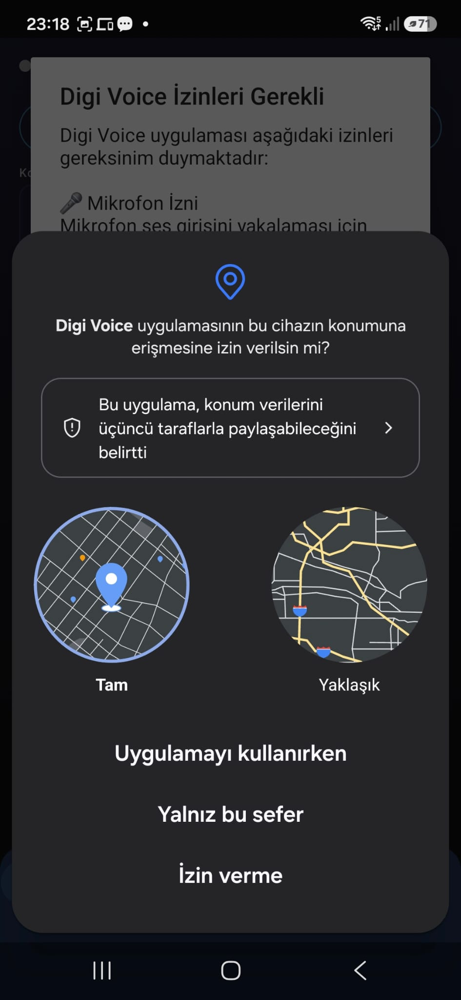
*"Digi Voice uygulamasının bu cihazın konumuna erişmesine izin verilsin mi?" sorusuna **"Uygulamayı kullanırken"** cevabını veriyoruz.*

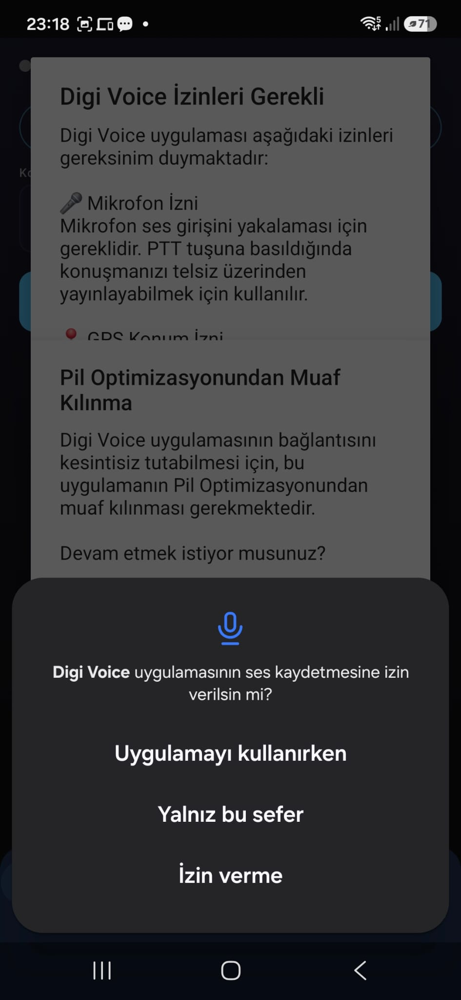
*"Digi Voice uygulamasının ses kaydetmesine izin verilsin mi?" sorusuna **"Uygulamayı kullanırken"** cevabını veriyoruz.*

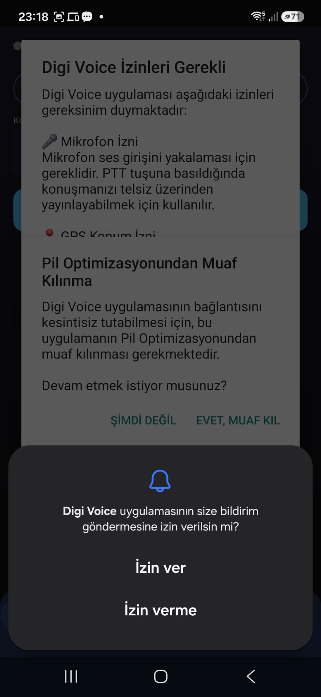
*"Digi Voice uygulamasının size bildirim göndermesine izin verilsin mi?" sorusuna **"İzin Ver"** cevabını veriyoruz.*

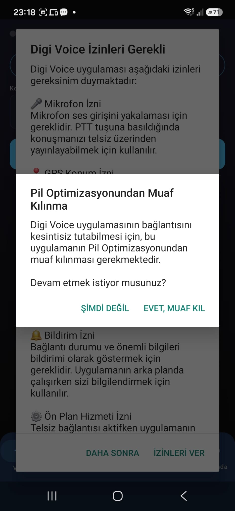
*"Pil Optimizasyonundan Muaf Kılınma" sorusuna **"EVET, MUAF KIL"** cevabını veriyoruz.*

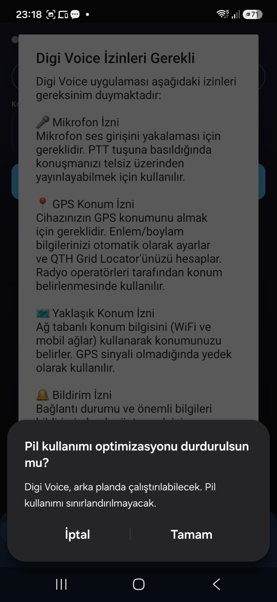
*"Pil kullanımı optimizasyonu durdurulsun mu?" sorusuna **"TAMAM"** cevabını veriyoruz.*

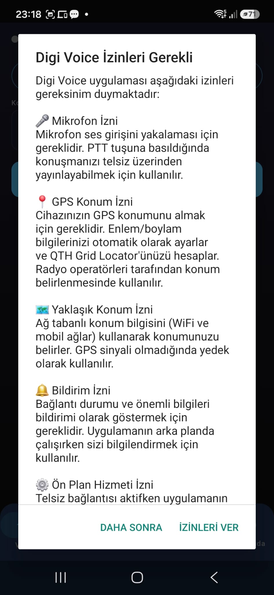
*"Digi Voice İzinleri Gerekli" ekranına gelen bu formda **"İZİNLERİ VER"** seçeneğini onaylıyoruz.*

> 💡 **Neden bu izinler önemli?** Pil optimizasyonundan muaf tutulmazsa, telefon uygulamayı arka planda uyutabilir ve bu da gelen çağrıları kaçırmanıza ya da bağlantının kopmasına neden olabilir.

  <figure style="flex:1; min-width:150px;">
    <Image src={digivoice_image_010} alt="Digi Voice ana ekranı" />
  </figure>
  <figure style="flex:1; min-width:150px;">
    <Image src={digivoice_image_011} alt="Digi Voice ana menü ve alt seçenekler" />
  </figure>
  <figure style="flex:1; min-width:150px;">
    <Image src={digivoice_image_012} alt="Digi Voice Ayarlar sekmesi" />
  </figure>

Tüm izinleri verdikten sonra uygulama ana ekranıyla karşılaşıyoruz. Alt menüden **"Ayarlar"** sekmesine giriyor ve uygulamayı çalışır hale getirmek için gerekli yapılandırmayı yapıyoruz.

### ⚙️ Adım 3 — Ayarların Yapılandırılması

Bu bölümde dikkat etmeniz gereken iki kritik nokta var: **BrandMeister SelfCare** üzerinden tek seferlik oluşturduğunuz hotspot şifresi ve çağrı işaretinizin doğru yazılmış olması. Bağlantı sorunlarının büyük çoğunluğu bu iki noktadan kaynaklanır.

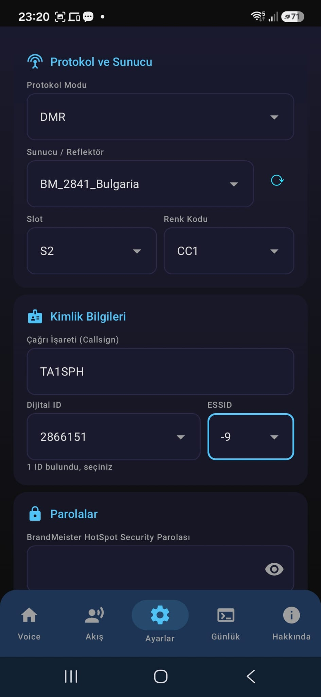

**A) Protokol ve Sunucu**

- **Protokol Modu:** `DMR` seçili olacak. *(NXDN, D-STAR gibi diğer protokoller bu makalenin kapsamı dışındadır.)*
- **Sunucu / Reflector:** `BM_2841_Bulgaria` seçilebilir. Diğer sunucuları da deneyip test edebilirsiniz; ancak bu kurulumda sorunsuz çalıştığı doğrulanmış olduğundan, ilk denemenizde bu sunucuyu seçmenizi öneririz.
- **Slot:** `S2` — varsayılan seçili kalabilir, değiştirmenize gerek yok (Time Slot TS1/TS2).
- **Renk Kodu:** `CC1` — varsayılan seçili kalabilir, değiştirmenize gerek yok (Color Code CC1/CC2).

**B) Kimlik Bilgileri**

- **Çağrı İşareti (Callsign):** Kendi çağrı işaretiniz. Harf veya rakam hatası yapmamaya özen gösterin — küçük bir yazım hatası bile bağlantı kurulamamasına yol açabilir.
- **Digital ID:** Çağrı işaretinize ait, [radioid.net](https://radioid.net) üzerinden oluşturulan DMR ID'niz. Çağrı işaretinizi yazdığınızda uygulama bu bilgiyi otomatik olarak sorgulayıp ekliyor.
- **ESSID:** Cep telefonundan bağlanıyorsanız `9 - Mobile` seçimi, aprs.fi üzerinde de bu şekilde görünecektir.

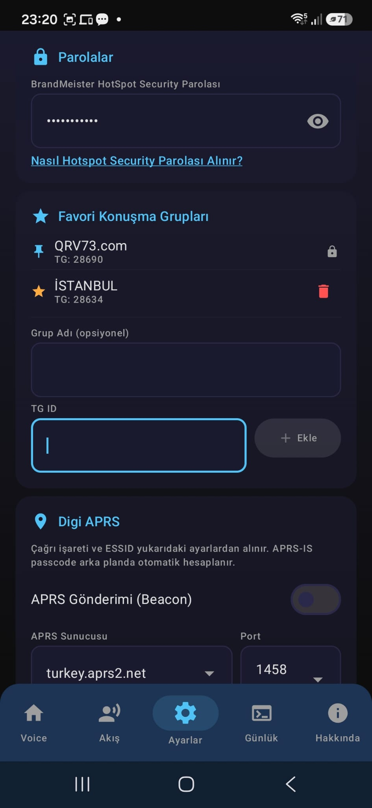

**C) Parolalar**

**BrandMeister Hotspot Security Parolası:** Bu parola, BrandMeister SelfCare panelinde oluşturduğunuz paroladır. Parolayı hatırlamıyorsanız veya emin değilseniz, SelfCare üzerinden güncelleyip buraya yeniden girebilirsiniz. Göz simgesine tıklayarak girdiğiniz parolayı görünür hale getirip kontrol edebilirsiniz.

**D) Favori Konuşma Grupları**

Varsayılan olarak `QRV73.com TG: 28690` gelir. Bunun yanı sıra en sık kullandığınız talkgrupları isimlendirip kaydedebilir, böylece her seferinde TG numarasını yazmak yerine favorilerinizden hızlıca seçim yapabilirsiniz.

- **Grup Adı:** Örneğin `İSTANBUL`
- **TG ID:** `28634` (İstanbul Talkgroup) yazıp **"+ EKLE"** butonuna basarak favorilerinize ekliyorsunuz.

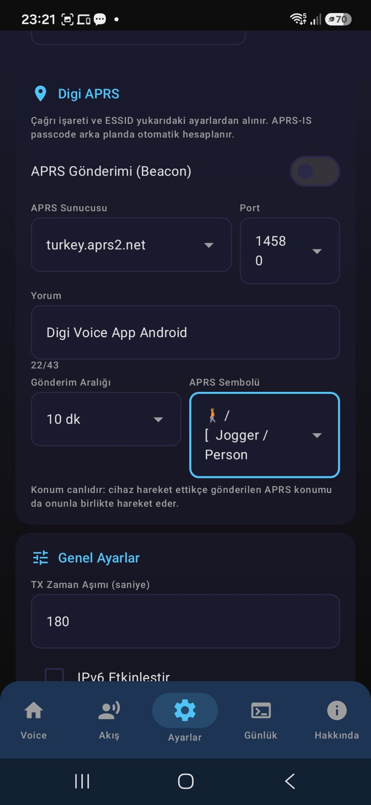

**E) Digi APRS**

Çağrı işaretiniz ve ESSID bilginiz ayarlardan otomatik alınır ve belirli aralıklarla konum bilginiz (beacon) gönderilir.

- **APRS Gönderimi (Beacon):** Açarsanız belirlediğiniz sürede konum bilginiz gönderilir ve hareket halindeyken aprs.fi üzerinden canlı takip edilebilirsiniz.
- **APRS Sunucusu:** `turkey.aprs2.net` varsayılan seçili kalabilir.
- **Port:** `14580` varsayılan seçili kalabilir.
- **Yorum:** `Digi Voice App Android` varsayılan olarak gelir, dilerseniz özelleştirebilirsiniz.
- **Gönderim Aralığı:** `10 dk` varsayılan olarak yeterlidir, ihtiyacınıza göre değiştirebilirsiniz.
- **APRS Sembolü:** Tamamen kişisel tercihinize bağlıdır (örneğin "Jogger / Person").

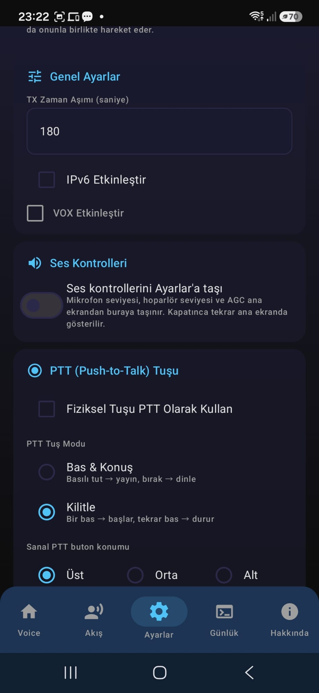

**F) Genel Ayarlar**

- **TX Zaman Aşımı (saniye):** PTT butonuna basılı kalınabilecek maksimum süredir. `180` saniye varsayılan olarak gelir; analog telsizlerde ideal süre genelde 60 saniye (1 dk) kabul edilir, ihtiyacınıza göre ayarlayabilirsiniz.
- **IPv6 Etkinleştir:** Varsayılan olarak kapalı kalabilir.
- **VOX Etkinleştir:** Varsayılan olarak kapalıdır.

**G) Ses Kontrolleri**

- **Ses kontrollerini Ayarlar'a taşı:** Varsayılan olarak kapalıdır. QSO sırasında mikrofon ve hoparlör seviyesini anlık değiştirmek isterseniz kapalı bırakmanız pratiklik sağlar.

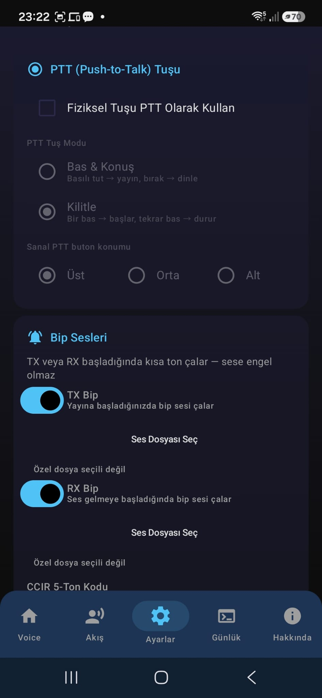

**H) PTT (Push-to-Talk) Tuşu**

Digi Voice'u benzerlerinden ayıran en önemli özelliklerden biri burada karşımıza çıkıyor: telefonunuzdaki fiziksel bir tuşu gerçek bir PTT düğmesi olarak atayabiliyorsunuz.

- **Fiziksel Tuşu PTT Olarak Kullan:** Bu seçeneği işaretliyoruz.

  <figure style="flex:1; min-width:150px;">
    <Image src={digivoice_image_018} alt="Digi Voice PTT tuş algılama ekranı" />
  </figure>
  <figure style="flex:1; min-width:150px;">
    <Image src={digivoice_image_019} alt="Digi Voice PTT tuşu onaylama ekranı" />
  </figure>

"Tuş Algıla" seçeneği aktif olduğunda, telefonunuzdaki istediğiniz bir tuşa basıp bırakmanız yeterli. Örneğin Samsung A55 modelinde "Ses Artırma" tuşu başarıyla algılanmıştır; farklı telefon modellerinde algılanan tuş değişebilir. Algılanan tuş ekranda gösterildikten sonra, yeşil renkli **"Kullan"** butonuna basarak ayarı aktif hale getirebilirsiniz.

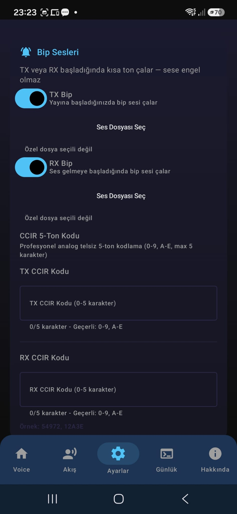

**I) Bip Sesleri**

Bu ayar tamamen kişisel tercihe bağlıdır ve uygulamanın çalışmasını etkilemez. PTT tuşuna basıldığında ve bırakıldığında bir bip sesi duyulur; dilerseniz kendi ses dosyanızı da seçebilirsiniz. Bu konuda daha fazla detay için QRV73 Telegram grubundan destek alabilirsiniz.

  <figure style="flex:1; min-width:150px;">
    <Image src={digivoice_image_021} alt="Digi Voice ayarları yedekle ekranı" />
  </figure>
  <figure style="flex:1; min-width:150px;">
    <Image src={digivoice_image_022} alt="Digi Voice ayarları geri yükle ekranı" />
  </figure>

**J) Ayarları Yedekle / Geri Yükle**

Bu bölümde uygulama ayarlarınızı telefonunuza yerel olarak yedekleyebilir, cihaz değişikliği veya sıfırlama gibi durumlarda yedek dosyanızı seçerek tüm ayarlarınızı saniyeler içinde geri yükleyebilirsiniz.

  <figure style="flex:1; min-width:150px;">
    <Image src={digivoice_image_023} alt="Digi Voice yedekleme onayı" />
  </figure>
  <figure style="flex:1; min-width:150px;">
    <Image src={digivoice_image_024} alt="Digi Voice yedek dosyası seçimi" />
  </figure>
  <figure style="flex:1; min-width:150px;">
    <Image src={digivoice_image_025} alt="Digi Voice ayarlar geri yükleme tamamlandı" />
  </figure>

### 🎙️ Adım 4 — Bağlantı Kurma ve İlk QSO

Ayarlarımızı tamamladıktan sonra, uygulamanın alt menüsünden **"Voice"** sekmesine geçerek bağlantı kurup QSO yapmaya başlayabiliriz.

- **Konuşma Grubu (TG ID):** Varsayılan olarak `28690` gelir. Buraya istediğiniz TG ID'sini yazabilir veya yukarıdan favorilerinizden seçim yapabilirsiniz.
- **Özel Çağrı:** Varsayılan olarak seçili değildir. Örneğin TB1TFO (DMR ID: 2860722) ile özel bir görüşme yapmak isterseniz bu seçeneği işaretleyip Konuşma Grubu alanına karşı tarafın DMR ID'sini yazmalısınız.

> ⚠️ **Not:** Özel Çağrı seçeneği aktifken talkgruplar üzerinden görüşme yapamazsınız; ilgili seçeneği kapatmayı unutmayın.

---

## ✅ Sonuç

Bu yazıda anlatılan adımlar ve ekran görüntüleri, uygulamanın güncel sürümüne göre küçük farklılıklar gösterebilir; çünkü Digi Voice sık sık güncellenerek yeni özelliklerle zenginleştiriliyor. Kurulum veya bağlantı sırasında herhangi bir sorunla karşılaşırsanız, aşağıdaki Telegram gruplarından bize ulaşabilirsiniz:

- 📢 QRV73! Telegram Grubu
- 📢 Amatör Telsiz Telegram Grubu
- 📢 Amatör Radyocular Derneği Telegram Grubu

Emeği geçen geliştirici ekibe destek olmak için, uygulamayı indirdiğiniz mağazada oy vermeyi ve yorum bırakmayı unutmayın.

73! İyi DX'ler dileriz.

**TA1SPH Oprt. Suphi**
*28690 QRV 73!*
