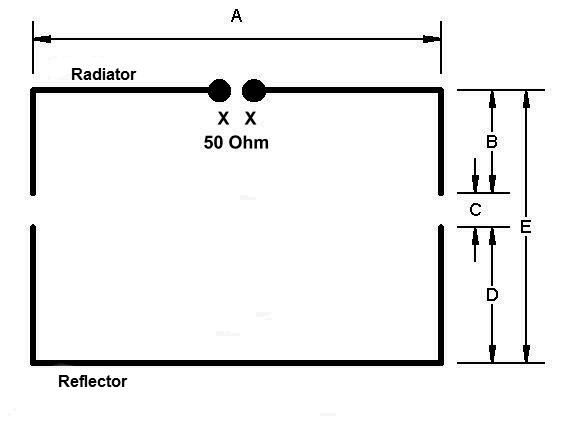
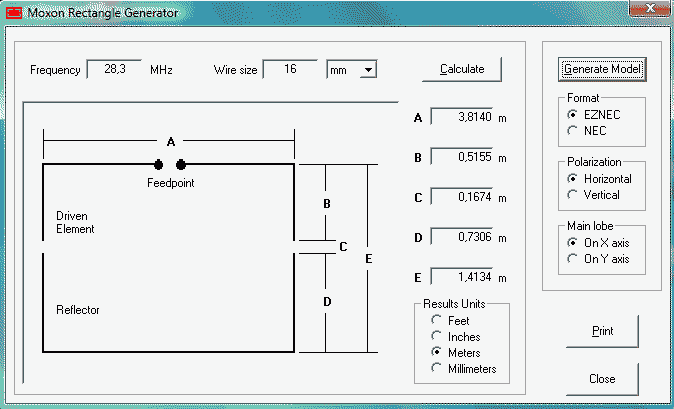

## 🎯 Giriş: Moxon Anten Nedir?

**Moxon anten**, sınırlı alanlarda çalışan amatör telsizciler için kompakt, yönlü ve yüksek verimli bir anten çözümüdür. Adını mucidi **Les Moxon (G6XN)**'dan alan bu anten, düşük **SWR**, yüksek **ön/arka oranı (F/B)** ve **kompakt tasarımı** ile dikkat çeker.

### 🔍 Moxon Antenin Yapısı ve Çalışma Prensibi

Moxon anten, klasik bir **Yagi anten** mantığında çalışır ancak daha kompakt bir yapıya sahiptir. Anten iki ana parçadan oluşur:

- **Sürücü eleman (Driven element):** Sinyali ileten ana elemandır.

- **Reflektör eleman (Reflector):** Sinyalin tek yönde yayılmasını sağlar.

Bu iki eleman, uçları bükülerek dikdörtgen formu oluşturur. Bu form, fazladan kazanç ve yönlü performans sağlar.
🧠 **Not:** İdeal bir Moxon anten, yönlü performans ile birlikte düşük parazit alımı sunar.

### ✅ Moxon Antenin Avantajları

Avantaj
Açıklama

📏 Kompakt Tasarım
Yagi antenlere göre %30 daha küçük

📡 Yönlü Yayılım
Yüksek ön/arka oranı ile sinyal odaklaması

⚡ Düşük SWR
Geniş frekans aralığında düşük SWR

🧲 50 Ohm Uyumlu
Beslemesi kolay

🎒 Hafif ve Portatif
Saha operasyonlarına uygun

🌬️ Düşük Rüzgar Direnci
Açık yapısı ile rüzgardan az etkilenir

### 🛠️ Moxon Anten Nasıl Yapılır?

#### 1️⃣ Frekans Belirleme ve Ölçü Hesaplama

Kullanmak istediğiniz frekansa göre ölçüleri belirlemek için şu hesaplayıcıyı kullanabilirsiniz:
🔗 [Moxon Anten Hesaplayıcı - DK7ZB](https://www.qsl.net/dk7zb/Moxon/Moxon.htm)

#### 2️⃣ Malzeme Listesi

- Alüminyum ya da bakır tel (elemanlar için)

- PVC boru ya da plastik destek (izolatör)

- RG-58 / RG-213 koaksiyel kablo

- Lehim, vidalar, kelepçeler

#### 3️⃣ Yapım Adımları

- Elemanları belirtilen uzunlukta kesin.

- Uçlarını izolatörler ile birleştirerek dikdörtgen formu elde edin.

- Koaksiyel kablonun merkez ucu sürücü elemana bağlanır.

- SWR metresi ile ölçüm yapın ve ince ayarlar ile optimize edin.

### 🔄 Çift Bantlı (Dual-Band) Moxon Anten

144 MHz ve 432 MHz gibi frekanslarda çalışmak istiyorsanız çift bantlı bir Moxon anten tasarımı yapabilirsiniz.

#### Duo-Band Tasarım Detayları:

- Her bant için rezonans ölçüleri hesaplanmalı

- İki eleman seti birbirinden yalıtılmalı

- Trap ya da ayrı besleme hattı kullanılabilir

🔗 Ayrıntılı bilgi: [Dual Band Moxon Anten - DK7ZB](https://www.qsl.net/dk7zb/Duoband/small_duobandantenna.htm)

### 🔚 Sonuç: Neden Moxon Anten?

Moxon antenler, **sınırlı alanda yüksek performans** isteyenler için ideal bir çözümdür. Kolay yapımı, uygun maliyeti ve etkili yönlü performansı sayesinde hem sabit istasyonlarda hem de taşınabilir uygulamalarda tercih edilmektedir.
🛠️ Anten üretmeyi düşünüyorsanız, Moxon anten size harika bir başlangıç noktası sunabilir.
📈 Doğru ölçüm, dikkatli montaj ve test ile yüksek verimli bir Moxon anten elde edebilirsiniz.

