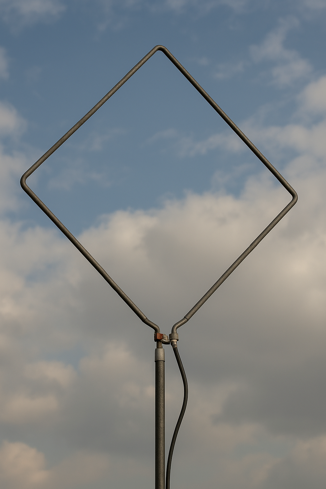
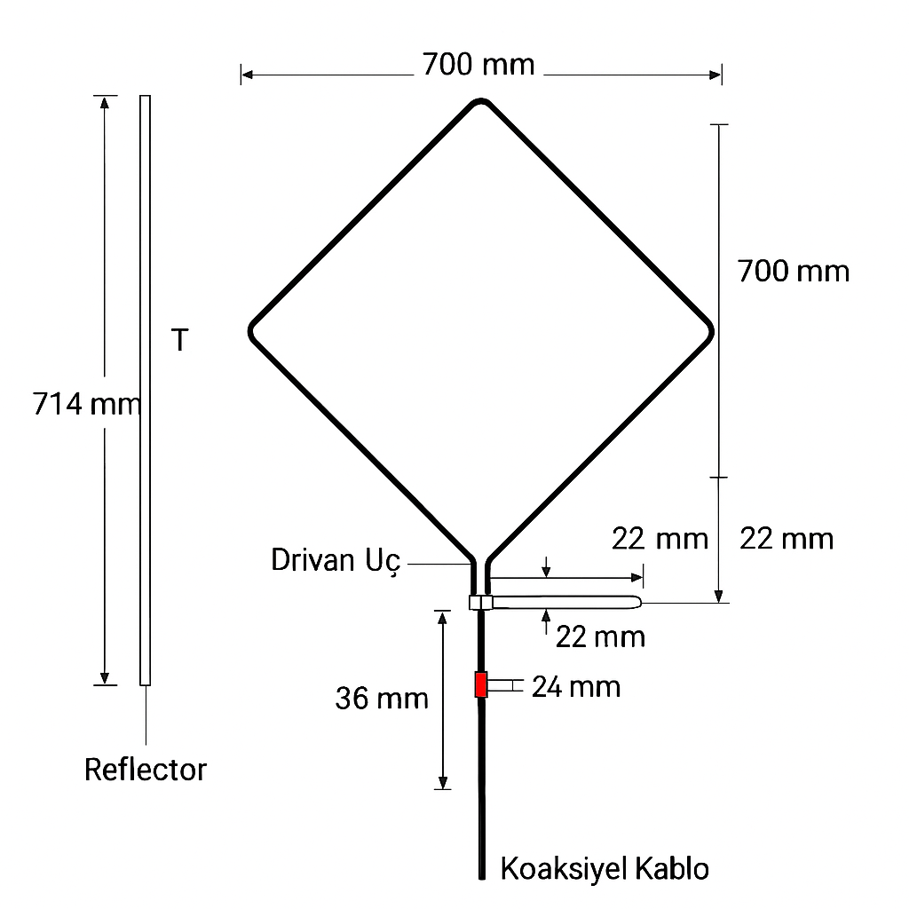
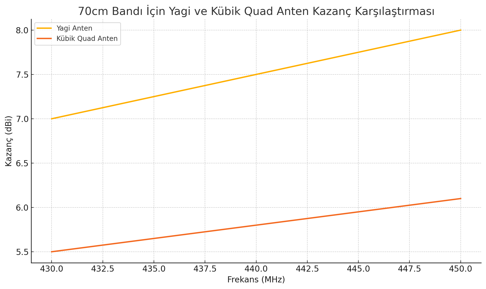

## 📡 Giriş

Bu antenle tanışmamı sağlayan sevgili **TA3BS "Antenci Dede" Hasan Tahsin Demirarslan** amcaya gönülden teşekkür ederim.

**Tam dalga boyu UHF Kübik Quad anteni**, amatör telsizcilikte ve bazı profesyonel uygulamalarda tercih edilen, **yüksek kazançlı** ve **dayanıklı** bir yönlü anten türüdür.

Bu yazıda:

- Antenin tarihçesi

- Teorik yapısı

- Kazanç değerleri

- Yapım malzemeleri ve hesaplama formülü
  detaylıca ele alınacaktır.

### 📜 Kökeni

Kübik Quad anteni, ilk kez **1942 yılında Clarence C. Moore** tarafından geliştirilmiştir.

**Yagi-Uda antenlere alternatif** olarak tasarlanmış; özellikle tropikal iklimlerde, Yagi antenlerin kırılganlığına çözüm olarak ortaya çıkmıştır.

### 📘 Anten Teorisi

Kübik Quad, **tam dalga boyunda** kapalı döngülerden oluşur. Bu döngüler:

- **Elektromanyetik dalgaları daha verimli yayar.**

- İki veya daha fazla elemanla kullanıldığında, **faz farkı** ile yönlü kazanç sağlar.

🔍 _Teorik yapı: her çerçeve 4 kenarlı (quad) bir halka oluşturur._

### 📈 Anten Kazancı

Kübik Quad antenler:

- Aynı sayıda eleman içeren Yagi antenlerden **yaklaşık 2 dB daha fazla kazanç** sunar.

- Tek çift elemanlı bir modelde kazanç **8–10 dBi**,

- Çok elemanlı modellerde **12–15 dBi’ye kadar** çıkabilir.

### 🧩 “Kübik Quad” Ne Demek?

- **"Kübik"**: Antenin 3 boyutlu çerçeve (küp) yapısından gelir.

- **"Quad"**: Her elemanın **4 kenarı** olduğuna işaret eder.

- Bu tasarım, antenin elektromanyetik performansını artırır.

### 🔧 Anten Tasarımı

Kübik Quad anten UHF bandında tipik olarak şu şekilde yapılır:

#### Temel Malzemeler:

Eleman
Açıklama

**İletken tel**
Döngüleri oluşturur.

**Fiberglas / PVC boru**
Çerçeve desteği sağlar.

**Boom**
Tüm yapıyı birleştirir.

**Besleme hattı**
Koaksiyel kablo (örnek: RG58)

#### Anten Elemanları:

- 🎯 **Sürücü (Driven Element)**: Besleme noktasıdır.

- 🛡️ **Reflektör (Reflector)**: Geri yansıyan sinyalleri engeller.

- 🚀 **Direktör (Director)**: Yayılım yönünü artırır.

### 📏 Anten Hesaplamaları

Kübik Quad antenlerde **her bir çerçevenin kenar uzunluğu** şu formülle hesaplanır:

#### 🔢 Formül:

L=300f×0.25L = \frac{300}{f} \times 0.25

📌 _Burada:_

- L: Kenar uzunluğu (metre)

- f: Frekans (MHz)

### Örnek:

**435 MHz** için hesaplama:

L=300435×0.25=0.172 metreL = \frac{300}{435} \times 0.25 = 0.172 \text{ metre}

Yani, **her bir kenar yaklaşık 17.2 cm** olmalıdır.

### 🏁 Sonuç

**Tam dalga boyu UHF Kübik Quad anteni**, yüksek performans isteyen amatör telsizciler için mükemmel bir tercihtir:

✅ Yüksek kazanç
✅ Düşük gürültü seviyesi
✅ Dayanıklı yapı
🔧 Basit malzemelerle, doğru hesaplamalar yapılarak **evde inşa edilebilir**. Deneyimli ya da yeni başlayan bir amatör telsizci olun, bu anten sizi memnun edecektir.

